# ADR 0002: Accounts and transfers

- Status: Accepted
- Date: 2026-10-04

## Context

A transaction records what money was spent on (category, type) but not where it came from. The
dashboard's "Balance this month" is a budget figure (income − expenses − savings for the month), not
money you actually have, so it can't show that a credit card is £600 down while the current account is
fine.

This ADR adds **accounts**: current accounts, savings, credit cards and cash. Every transaction comes out
of (or goes into) one account, each account has a real running balance, and the dashboard shows what is
actually available. The storyboard is the "Accounts" page of the Ledger Noir design canvas.

The work ships as a stack of pull requests (`accounts/00-…` to `accounts/07-…`, created with
`gh stack`). Unlike the Ledger Noir stack this one changes the schema.

## Storyboard

Directional, like the Ledger Noir storyboard: the real fields and behaviour win where they differ.

| Dashboard strip | Accounts | Account detail (card) |
|---|---|---|
| 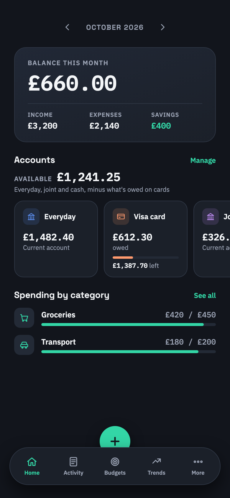 | 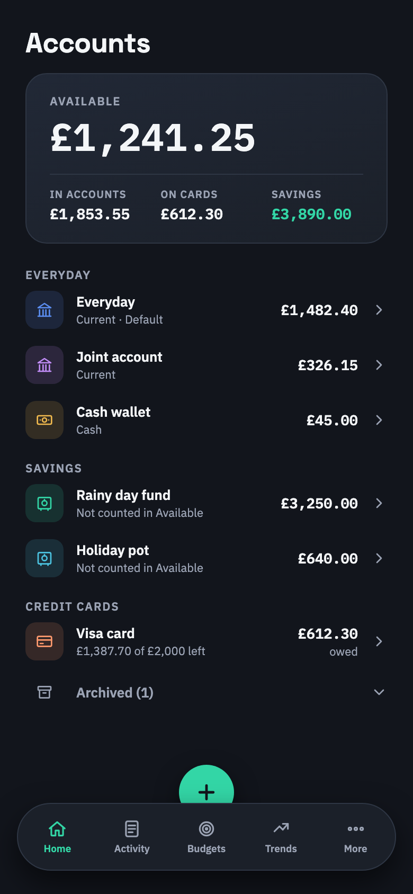 | 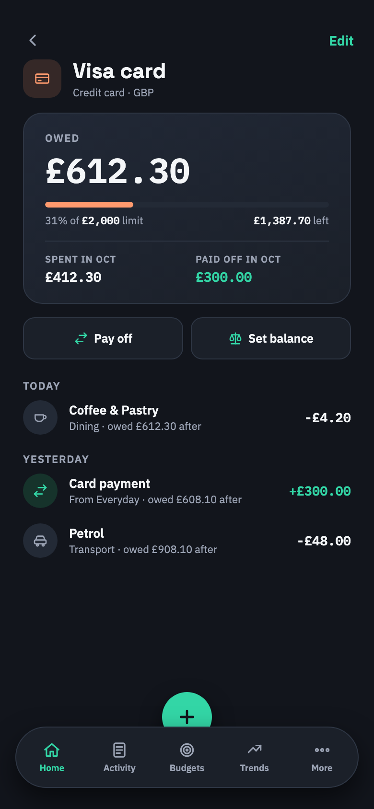 |

| Set balance | Add / edit account | Transaction: Paid from |
|---|---|---|
| 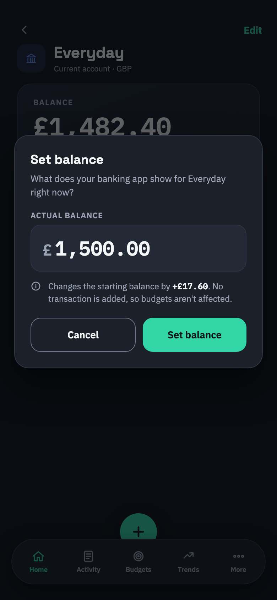 | 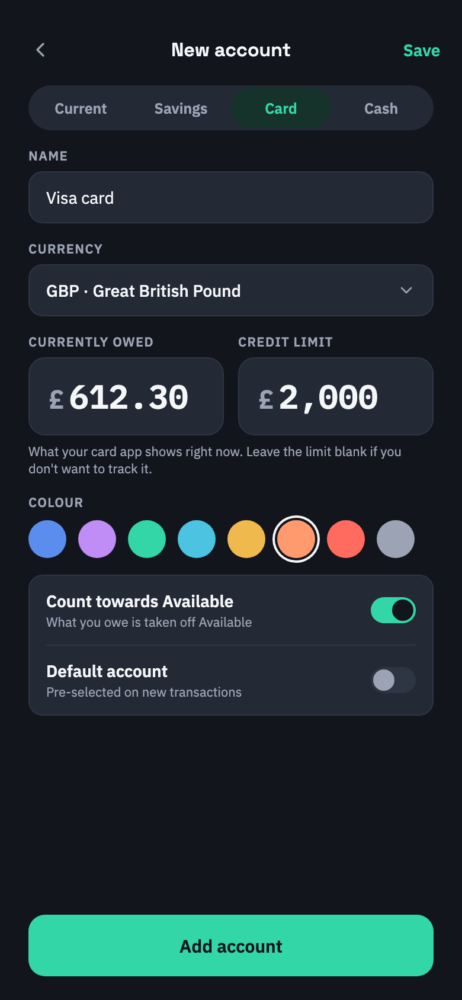 | 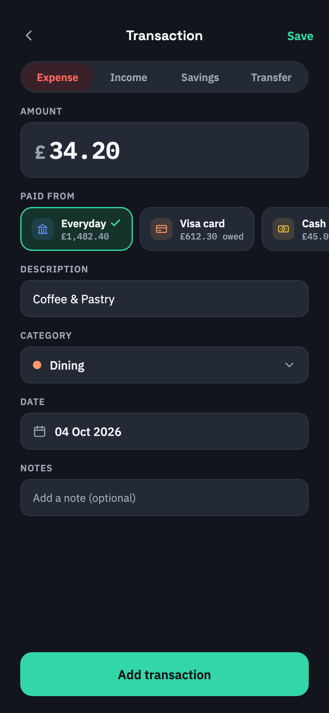 |

| Transfer | Activity | Accounts (light) |
|---|---|---|
| 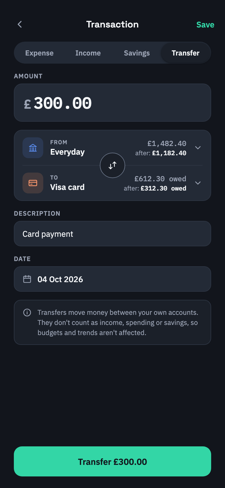 | 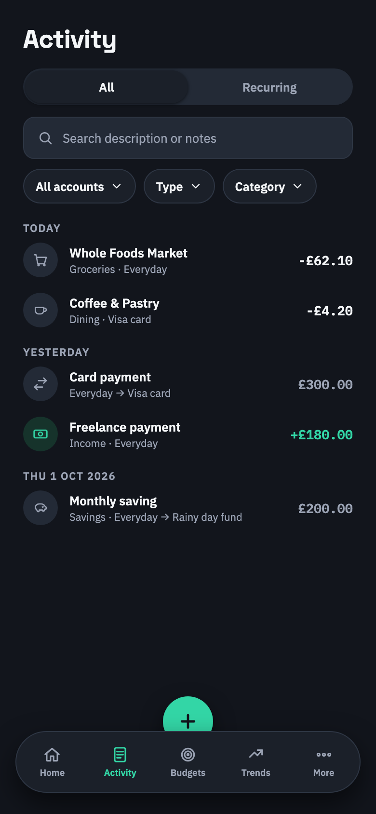 | 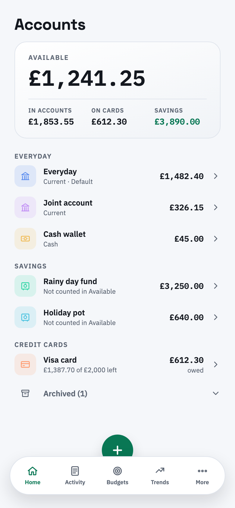 |

| Pots: accounts | Pots: dashboard | Pots: account detail |
|---|---|---|
| 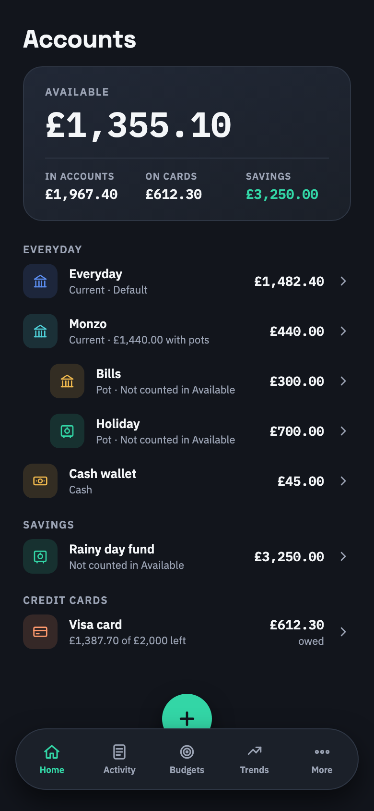 | 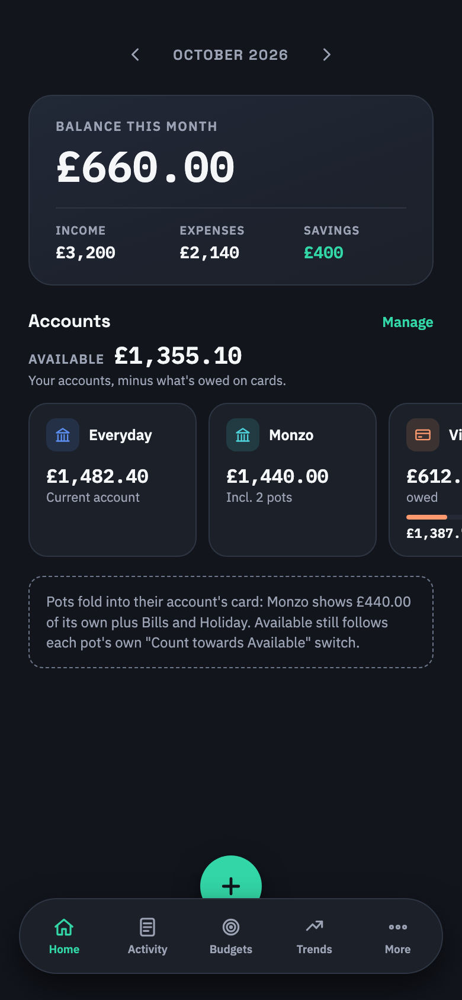 | 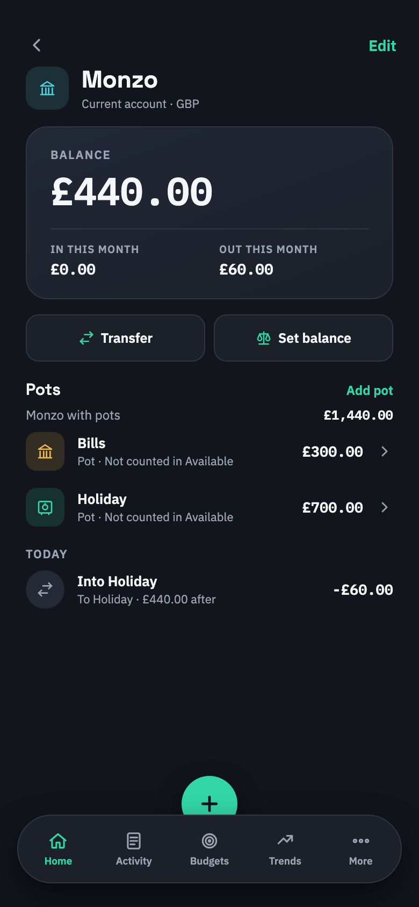 |

## Decisions

### 1. An account is required on every transaction

`Transaction.AccountId` and `RecurringTransaction.AccountId` are required foreign keys
(`DeleteBehavior.Restrict`). The `AddAccounts` migration seeds a default **Main account** (Id 1, current
account, currency Id 1) and assigns every existing transaction and recurring transaction to it. Rows in
another currency get a per-currency account instead (`Main account (EUR)`), because an account has a
single currency (decision 4). Fresh installs get the seeded Main account too.

An account in use can't be deleted; it can be archived. The default account can't be archived.

### 2. Transfers are a transaction type

`TransactionTypeEnum.Transfer` moves money between two of your own accounts (`AccountId` → `ToAccountId`).
It never counts as income, spending or savings, so budgets, trends and notifications are unaffected:
they already filter on positive matches (`== Expense`, `== Savings`). A transfer has no category.

`Savings` keeps its budget meaning and gains an optional `ToAccountId`, so "£200 into the Rainy day fund"
moves the money between accounts *and* counts toward the month's savings. In lists, a transfer or a
savings transaction with a destination shows **no sign**: the money stayed yours.

### 3. Balances are computed, never stored

```
balance = OpeningBalance
        + Σ Income                        where AccountId = a
        − Σ Expense, Savings, Transfer    where AccountId = a
        + Σ Savings, Transfer             where ToAccountId = a
```

Only transactions dated today or earlier count. `AccountBalanceService` computes every balance with two
grouped queries. There is no stored balance to drift out of sync with edits and deletes.

**Sign convention:** a balance is the account's value to you, so a card that owes £600 has a balance of
−600. Forms ask for "Currently owed" on cards and store it negated; nobody types a minus sign.
For a card, `owed = max(0, −balance)` and, when a limit is set, `availableCredit = CreditLimit − owed`.

**Set balance** reconciles an account with the bank: it recalculates `OpeningBalance` so the balance
matches the figure entered. It never inserts an adjusting transaction, so budgets stay clean.

### 4. The currency follows the account

A transaction's currency is its account's currency, so the transaction form drops the currency picker.
A foreign-currency purchase on a GBP card is recorded in GBP, which is what actually left the account.
Transfers must be between accounts in the same currency. `Currency.ExchangeRate` isn't used in any
calculation today, so totals don't convert: **Available** sums default-currency accounts and lists other
currencies separately.

### 5. Available

```
Available = Σ balance of accounts with IncludeInAvailable, not archived, in the default currency
          (+ Σ availableCredit of those cards when "Count available credit" is on)
```

`IncludeInAvailable` defaults on for current accounts, cash and cards (what you owe is subtracted) and
off for savings. Available credit is opt-in (`SettingsService.IncludeCreditInAvailable`).

### 6. Navigation

The five tabs stay. `/accounts` (list), `/accounts/{id}` (detail), `/accounts/add` and
`/accounts/edit/{id}` belong to the Home tab; the dashboard's accounts strip and the More hub link to
them. All routes are added to `NavDestinations`; no existing route changes.

### 7. Pots

An account can sit inside another (`Account.ParentAccountId`), e.g. Monzo pots inside the Monzo current
account. A pot is a full account with its own balance, type and "Count towards Available" switch;
moving money into it is a transfer (or savings with an Into account). Rules:

- One level only: a pot can't have pots, and an account with pots can't become one.
- A pot shares its parent's currency, so transfers between them always work.
- Cards are never pots or parents.
- The parent can't be deleted while it has pots (FK `Restrict`) or archived while any pot is open. If a
  parent is archived later, its pots stand on their own.

Pots only change presentation: the accounts list nests them under the parent, the parent's detail page
lists them with the combined total, and the dashboard strip shows one card per parent with that total.
Available is unchanged; it still sums each account by its own switch.

## Consequences

- One migration with a hand-checked backfill. SQLite rebuilds `Transactions` and
  `RecurringTransactions` to add the foreign keys.
- Every place that reads `TransactionType` must treat `Transfer` as neither income nor outflow. Lists
  show transfers as "From → To" rows without a sign.
- Out of scope: linking goals to a savings account, cross-currency transfers, converted totals,
  importing statements into an account, card statement cycles.
