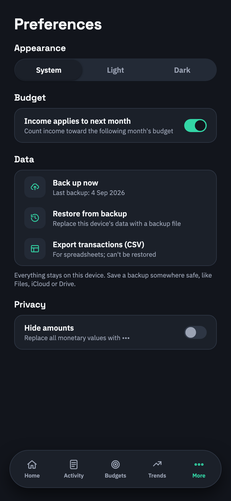
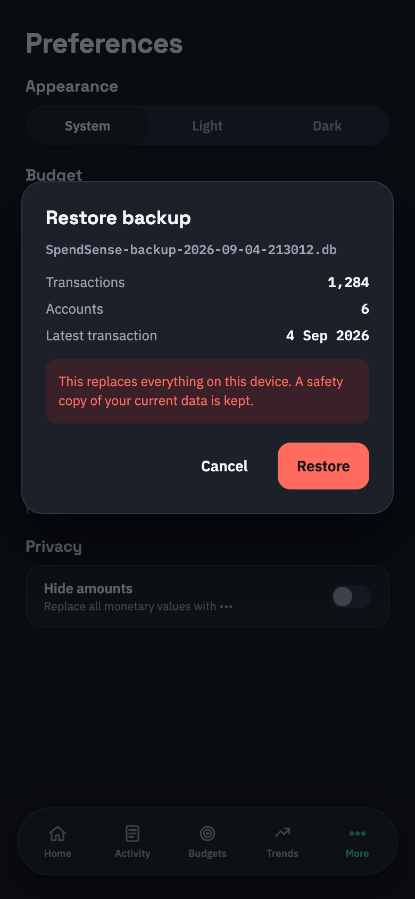
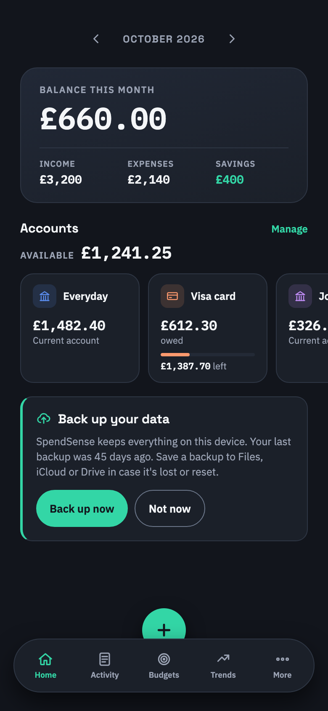

# ADR 0003: Backup, restore and CSV export

- Status: Accepted
- Date: 2026-10-04

## Context

SpendSense is local-first: everything lives in one SQLite file on the device, and cloud sync is still on
the roadmap. Losing or resetting the phone loses every transaction, account and budget. Users also want
their transactions in a spreadsheet.

## Storyboard

| Preferences → Data | Restore confirmation | Dashboard reminder |
|---|---|---|
|  |  |  |

## Decisions

### 1. A backup is the SQLite database itself

A backup is a copy of `SpendSense.db`, made with SQLite's backup API (`SqliteConnection.BackupDatabase`),
which can safely copy the database while the app is using it, so the copy is always consistent. Nothing
goes over the network: the copy is made on the device.
It's named `SpendSense-backup-YYYY-MM-DD-HHMM.db`, written to the cache directory, and handed to the share
sheet: Files, iCloud Drive, Google Drive, email, AirDrop and so on. The app doesn't store backups anywhere
itself. The share sheet is the destination picker.

Nothing is converted, so a backup restores exactly, including the migration history. Device preferences
(theme, hide amounts, active month) aren't in the database and aren't backed up: they're per-device by design.

### 2. Restore is checked, upgraded and reversible

Restoring a file:

1. **Check it.** It must open as SQLite, pass `PRAGMA quick_check`, and have SpendSense's tables and EF
   migration history. A backup containing a migration this app doesn't know was made by a newer version,
   so it's refused ("update the app first") instead of corrupting the schema.
2. **Confirm it.** The dialog shows what's in it (transactions, accounts, latest transaction) and that
   it will replace the current data.
3. **Keep a safety copy.** The current database is backed up to `AppData/SpendSense/Backups/` first. The
   newest three are kept.
4. **Copy it over the live database** with the backup API (no file swapping while connections are open).
   Then clear EF's change tracker and run migrations, so an older backup is upgraded exactly as on launch.

### 3. CSV export is for spreadsheets, not for restoring

`SpendSense-transactions-YYYY-MM-DD.csv` (UTF-8 with BOM, so Excel opens it correctly) has one row per
transaction, oldest first, with the columns: Date (ISO), Description, Type, Category, Account, To account,
Amount, Currency and Notes.

- **Amount sign:** amounts are signed from the source account's point of view: income is positive,
  everything else (expense, savings, transfer) is negative, and `To account` names where a transfer or
  saving went.
- **Formats:** numbers use `.` and no thousands separators.
- **Formula injection:** text that starts with `=`, `+`, `-`, `@`, a tab or a carriage return gets a
  leading `'`, so a hostile description can't run as a spreadsheet formula.

### 4. A gentle reminder

Preferences shows when the last backup was made. The dashboard shows a dismissible prompt when there are
transactions and no backup in the last 30 days (or ever). "Not now" snoozes it for 30 days. "Backed up" is
recorded when the share sheet closes after a backup. The app can't tell whether the user actually saved
the file, so this is a best effort.

## Consequences

- **Seams:** MAUI's file system, share sheet and file picker are injected (`IFileSystem`, and `IFileExchange`
  over `IShare`/`IFilePicker`), so the backup logic runs in tests against real SQLite files.
- **Size:** a backup is the whole database, which is small for years of personal transactions.
- **Follow-ups:** automatic scheduled backups (to a folder the user picks once) and cloud sync remain on
  the roadmap.
